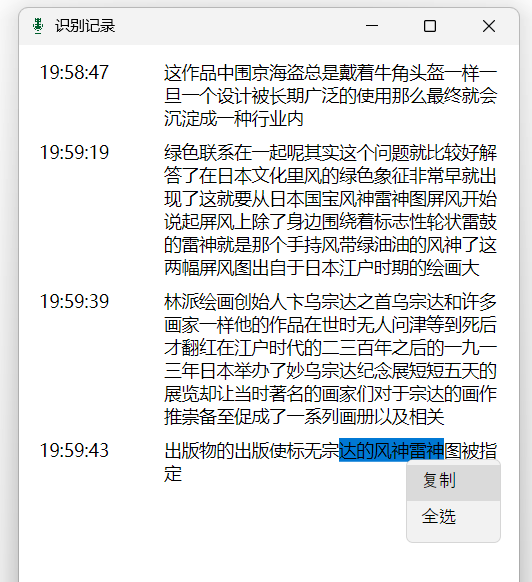
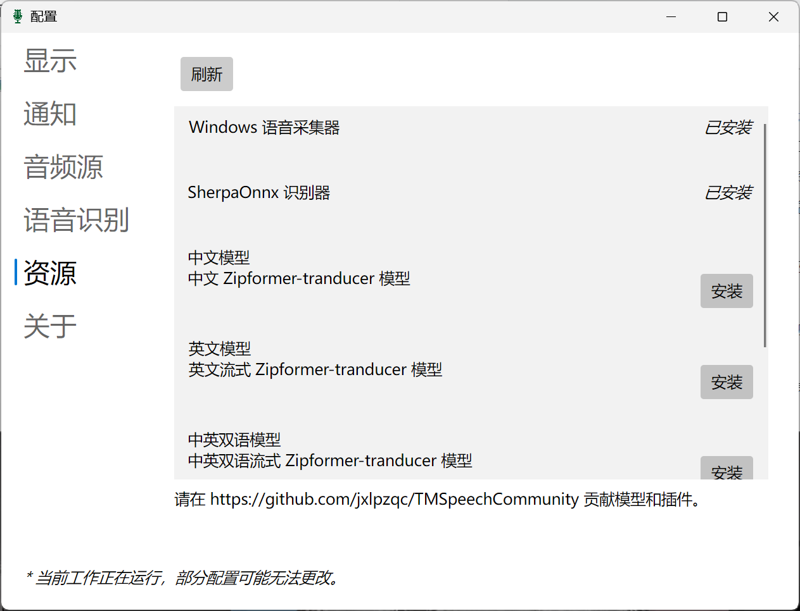

# TMSpeech

(旧版)视频演示：https://www.bilibili.com/video/BV1rX4y1p7Nx/

关键词：语音转文字，实时字幕，会议语音识别，歌词字幕展示，识别历史记录查看

`TMSpeech` 是一个Windows下的中文实时语音字幕，通过WASAPI的CaptureLoopback捕获电脑声音（录内音），将语音实时转文字，并以歌词字幕的形式展示。即使完全关闭电脑声音也能使用。

你可以：
- 开会时更放心地走神，突然被喊到的时候不会那么不知所措，只需要看一看识别的历史记录。（本项目的名字来源于此）
- 会议实时转录，自动生成会议纪要，并保存到文件。默认会将识别结果按日期保存到“我的文档”的`TMSpeechLogs`文件夹中

基于[sherpa-onnx](https://github.com/k2-fsa/sherpa-onnx/)项目二次开发。实测在我的AMD 5800u的笔记本上CPU占用不到5%。

再次感谢[sherpa-onnx](https://github.com/k2-fsa/sherpa-onnx/)项目的语音识别框架和模型。

## 展示

无边框窗口，可任意拖动和调整大小

历史记录页面（双击可复制）：

设置页面：

## 使用

在[Release](https://github.com/jxlpzqc/TMSpeech/releases)页面中下载最新的release解压，运行`TMSpeech.GUI.exe`即可。在桌面创建快捷方式，使用起来更加方便。

## 我们需要你的反馈

觉得很有用？但是还有不完美的地方？欢迎点击这里[创建Discussion](https://github.com/jxlpzqc/TMSpeech/discussions/new)、提出反馈！

- 识别准确率不高？
    - 这可能需要更好的模型。当前我们支持sherpa-onnx的流式模型，可以在[这里](https://k2-fsa.github.io/sherpa/onnx/pretrained_models/online-transducer/zipformer-transducer-models.html)下载其他模型，并在设置中修改模型路径。
    - [想要用自己的模型？](https://github.com/jxlpzqc/TMSpeech/issues/6) 如果你发现了效果更好的开源模型，也欢迎推荐给我们！
- 还需要更多功能？
    - 请点击这里[创建issue](https://github.com/jxlpzqc/TMSpeech/issues/new)告诉我们！
    - 如果你懂Windows/C#开发，欢迎提交pull request，开发的过程中遇到任何问题可以创建issue和我们讨论。

## 带模型的Release打包流程

- 在github actions中下载构建好的安装包
- 将模型文件夹复制到publish的文件夹内，重命名为models，打包为zip文件。
- 在开发电脑，和另外一台电脑上测试各种功能。
